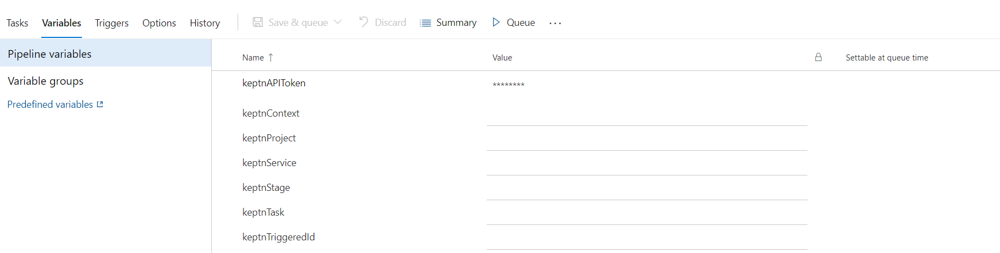

# Triggering Azure DevOps Pipelines from Keptn


1. Create an ADO Personal Access Token (PAT). Set permissions as `Build (Read and Execute)`.
2. Add a subscription to the Keptn webhook service for the relevant `task.triggered` event.
3. HTTP `POST` to `https://dev.azure.com/{organization}/{project}/_apis/pipelines/{pipelineId}/runs?api-version=6.0-preview.1` ([see Azure docs for full info](https://docs.microsoft.com/en-us/rest/api/azure/devops/pipelines/runs/run-pipeline?view=azure-devops-rest-6.0))
4. Add a header: `Authorization: Basic user:<PAT-TOKEN-HERE>` note `user` can be set to anything.
5. Add variables to the pipeline:

- `keptnAPIToken` (save this as a secret)
- `keptnContext`
- `keptnProject`
- `keptnService`
- `keptnStage`
- `keptnTriggeredID`

6. (optional see below) Add a pipeline task to send the `task.started` event
7. Add a pipeline task to send the `task.finished` event



## Started Event Task (optional)

```
TASK=$(echo $keptnTask | cut -d '.' -f 4)
echo "Task is: $TASK"
curl -X POST "https://mykeptn.com/api/v1/event" -H "accept: application/json" -H "x-token: $(keptnAPIToken)" -H "Content-Type: application/json" -d "{ \"data\": { \"project\": \"$(keptnProject)\", \"result\": \"pass\", \"service\": \"$(keptnService)\", \"stage\": \"$(keptnStage)\", \"status\": \"succeeded\", \"message\": \"ADO pipeline started...\" }, \"source\": \"azure-devops\", \"specversion\": \"1.0\", \"type\": \"sh.keptn.event.$(TASK).started\", \"shkeptncontext\": \"$(keptnContext)\", \"triggeredid\": \"$(keptnTriggeredId)\"}"
```

## Finished Event Task
```
TASK=$(echo $keptnTask | cut -d '.' -f 4)
echo "Task is: $TASK"
curl -X POST "https://mykeptn.com/api/v1/event" -H "accept: application/json" -H "x-token: $(keptnAPIToken)" -H "Content-Type: application/json" -d "{ \"data\": { \"project\": \"$(keptnProject)\", \"result\": \"pass\", \"service\": \"$(keptnService)\", \"stage\": \"$(keptnStage)\", \"status\": \"succeeded\", \"message\": \"ADO pipeline finished...\" }, \"source\": \"azure-devops\", \"specversion\": \"1.0\", \"type\": \"sh.keptn.event.$(TASK).finished\", \"shkeptncontext\": \"$(keptnContext)\", \"triggeredid\": \"$(keptnTriggeredId)\"}"
```


## Started and Finished Events: Webhook service or Azure DevOps Sends?

Choosing the webhook service to automatically send the `task.started` and `task.finished` events is the easiest solution. In this case, zero modifications are required to the pipeline.

However, in this case, the timing of the task is wrong because the time "seen" by Keptn is really the time it took to fire the HTTP POST (ie. instant).

You can also let the webhook service send the `task.started` event and delegate the `task.finished` event to the webhook receiver (ie. ADO). In which case, a modification is required so the job sends the `task.finished` event back to Keptn.

The benefit of this is that the timing is correct. Time is between firing of the HTTP POST and whenever you send the `task.finished` event.

> Webhook service sending the started event. Pipeline sends finished event. 99% of the time this is the correct setup.

The edge case for this setup is if you have included a start delay on the pipeline. Again, the timing starts when the webhook service fires the POST request. In these cases, you may wish to delegate BOTH `task.started` and `task.finished` events to ADO. More modifications required to the pipeline, but you are in complete control of the timings.
